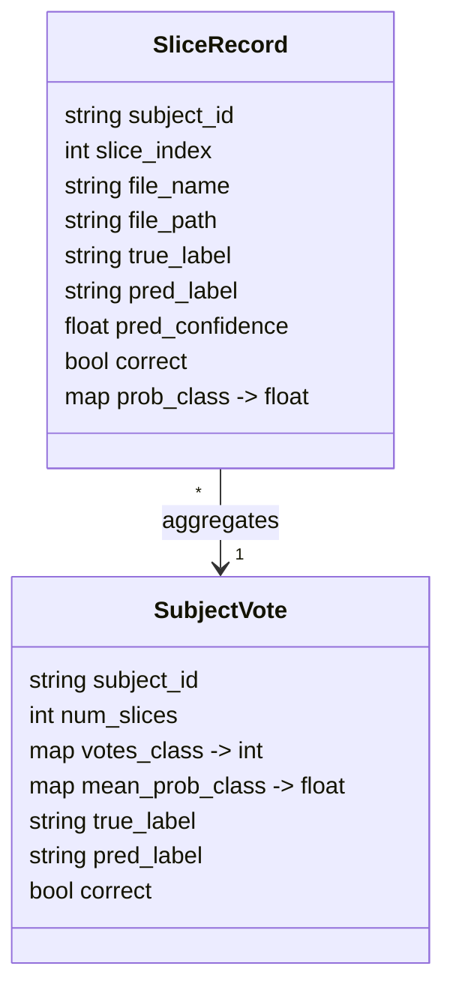

# Subject Evaluation Diagrams

## Pipeline Overview

```mermaid
flowchart LR
    A[Checkpoint (.pth)] --> B[Model Load]
    B --> C[Slice Loader (val/test split)]
    C --> D[Slice Inference]
    D --> E[Per-slice Log]
    E --> F{Group by Subject}
    F --> G[Vote Counts]
    F --> H[Probability Sums]
    G & H --> I[Majority Vote + Tie Break]
    I --> J[Subject Prediction]
    J --> K[Confusion + Accuracy]
    J --> L[Subject CSV]
    E --> M[Slice CSV]
    K --> N[Metrics JSON]
```

## Slice Log Schema


